# 

### Entry for the [Digital Field Book](https://github.com/amnh/HacktheDinos/wiki/Digital-Field-Book) challenge at Hack The Dinos.

### [Try it out here!](http://dinotes.jagels.io:3000/) *Must be on the "Hack the Dino's" wi-fi*
---
## DINOTE is built with

#### Front End
- Materialize.css
- JQuery
- Bower

#### Back End
- Node.js
- MongoDB
- Redis

#### Design
- Adobe Illustrator

---
## Design Mockups
### Desktop
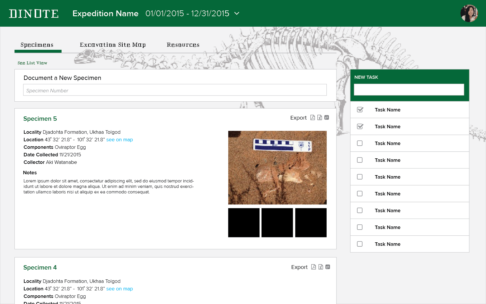
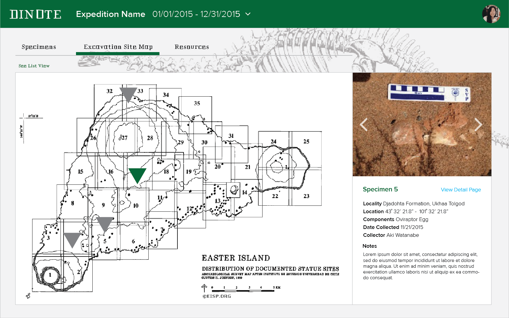
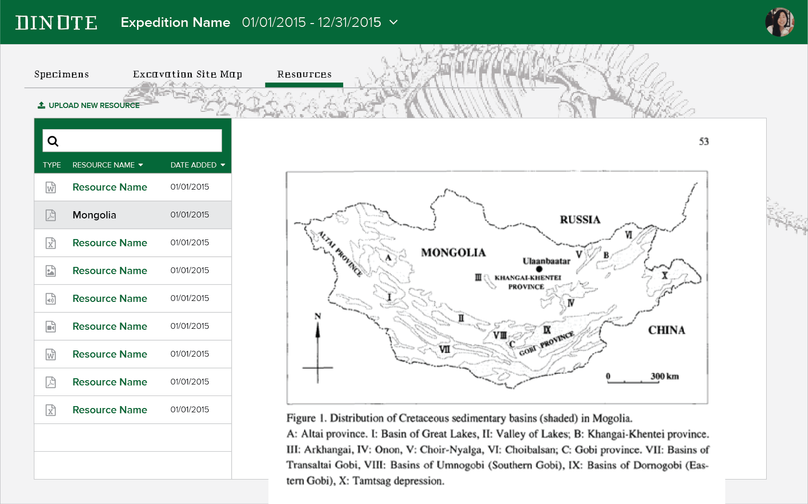
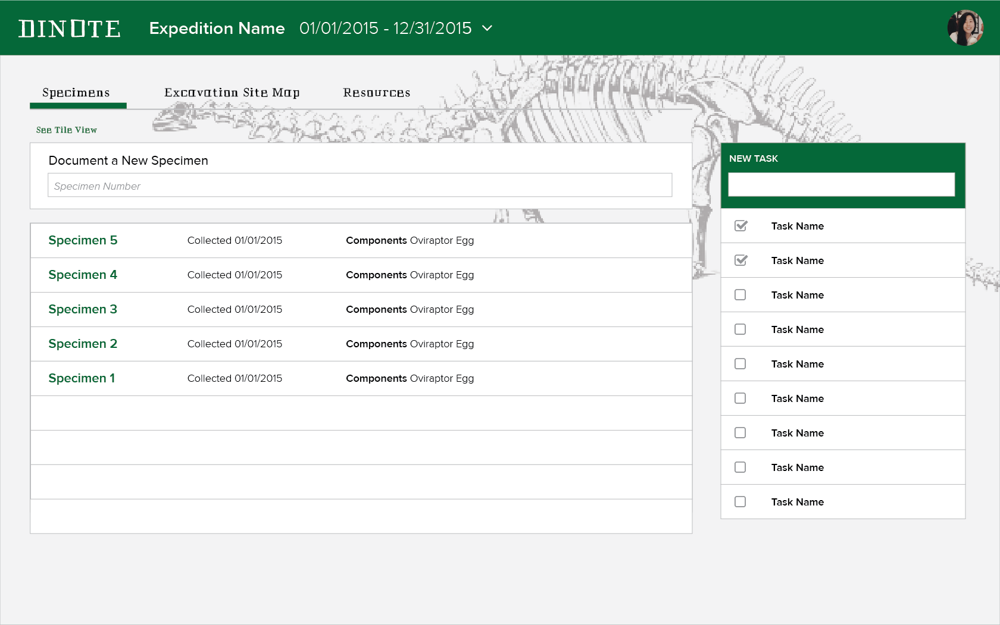
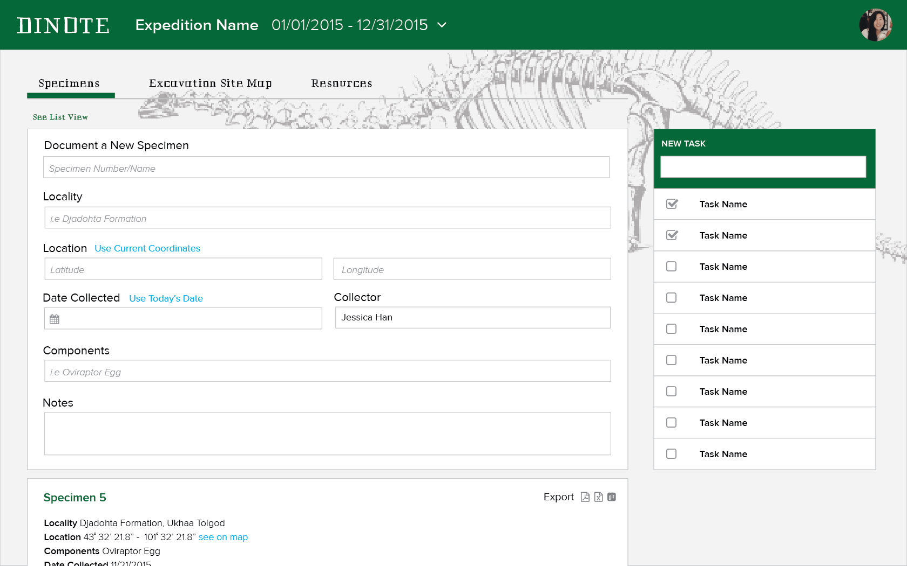
### Mobile
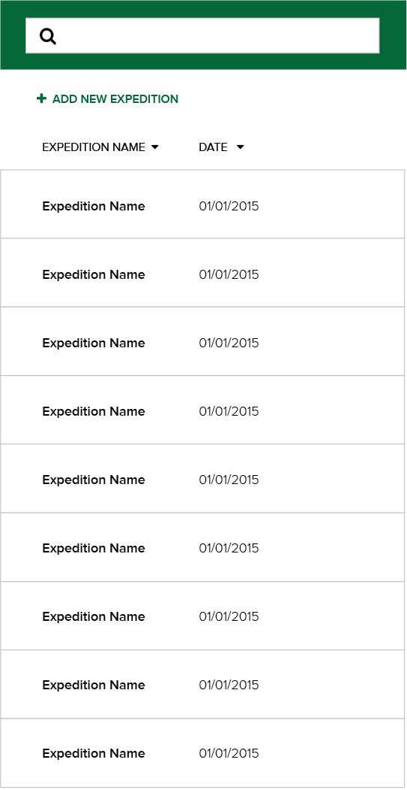
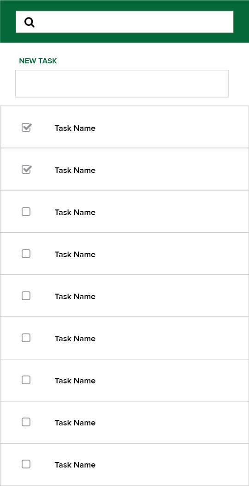
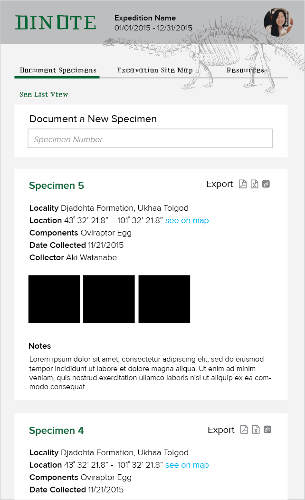
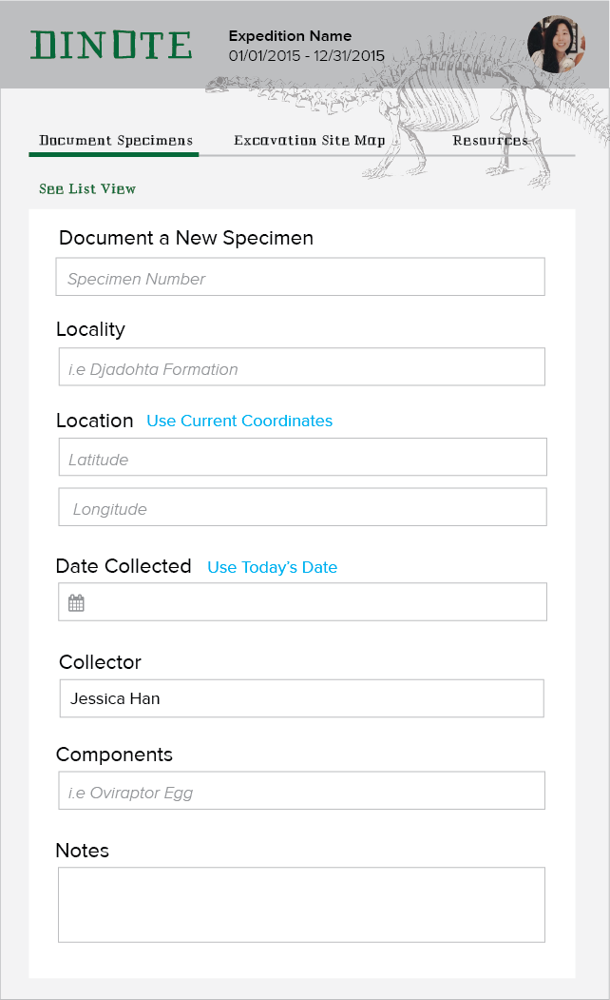
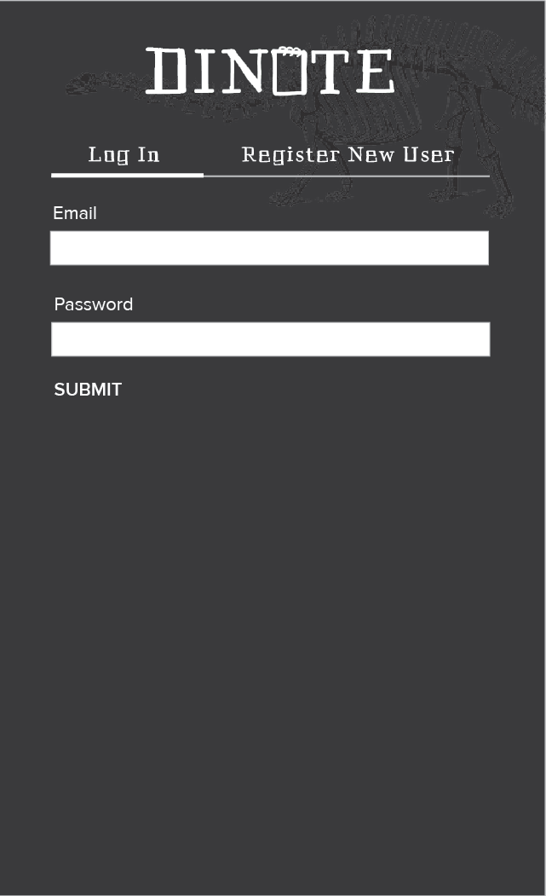

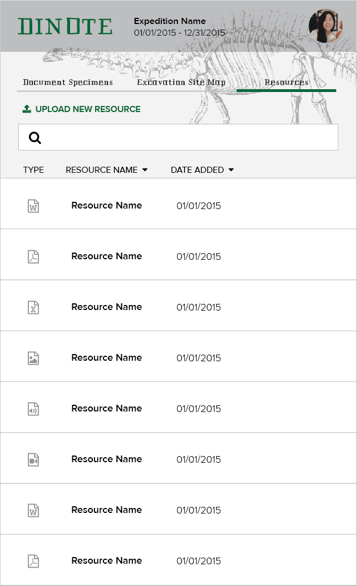
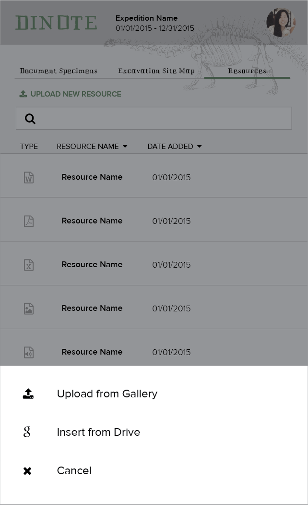
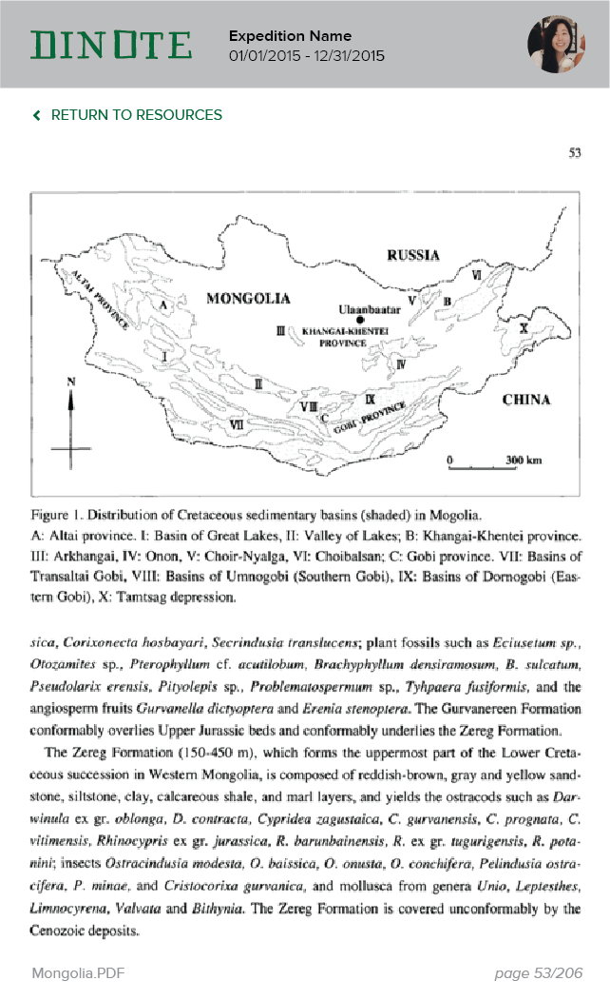
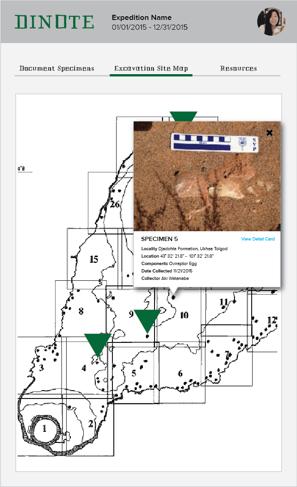
---
## The Team
Hacker|Representing|Worked on
---|---|---
[Yining Chen](http://github.com/YiningChen)     | Viacom       			| Back-End
[Emily Goetz](http://github.com/EmilyGoetz)     | Viacom       			| Full Stack
[Jessica Han](http://jessicahhan.com)           | ADP    			    | Design and UX
[Tim Hung](http://github.com/AvocadosConstant)	| Binghamton University	| Front-End
[William Jagels](http://github.com/wijagels) 	| Hudson River Trading	| Back-End
